# F1 Kotlin

Native Android app with Formula 1 stats  
(standings, results, calendar, predictor, circuits, profile).

Data:
- [Jolpica F1 API](https://github.com/jolpica/jolpica-f1) (Ergast-compatible) — schedule, results, standings
- [ESPN](https://site.api.espn.com/) — news (on Home), weekend scoreboard, driver photos

Same idea, other stacks:

- [f1_pet_project](https://github.com/DaniilPavlov/f1_pet_project) — Flutter (Android / iOS / Web)
- [f1_kmp](https://github.com/DaniilPavlov/f1_kmp) — Kotlin Multiplatform (Android / iOS)

## Screenshots

<p>
  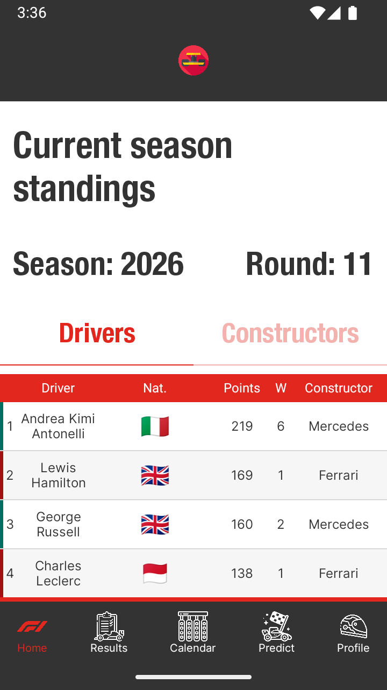
  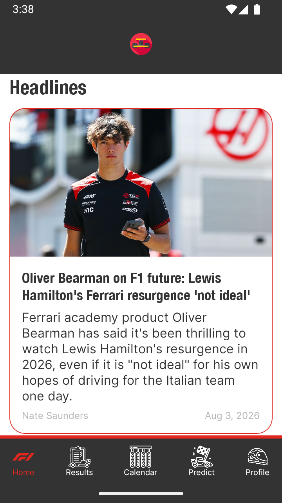
  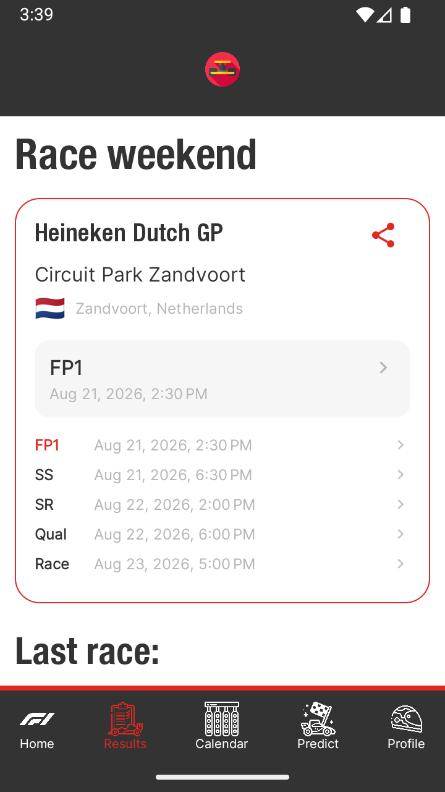
  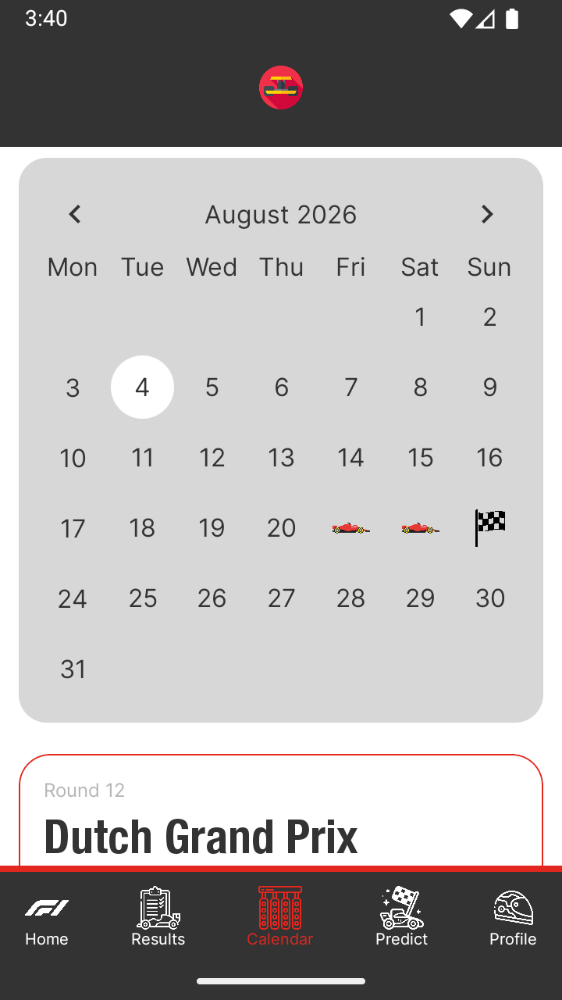
  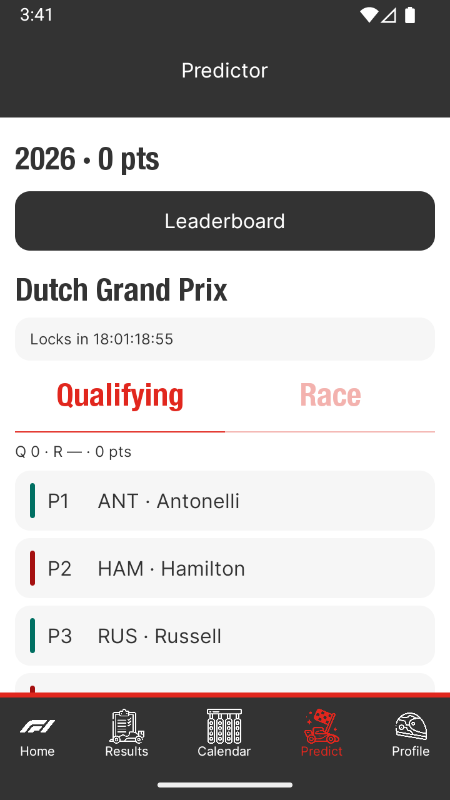
  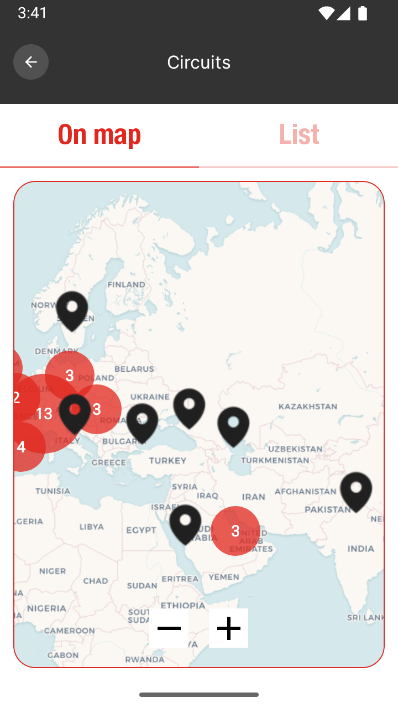
  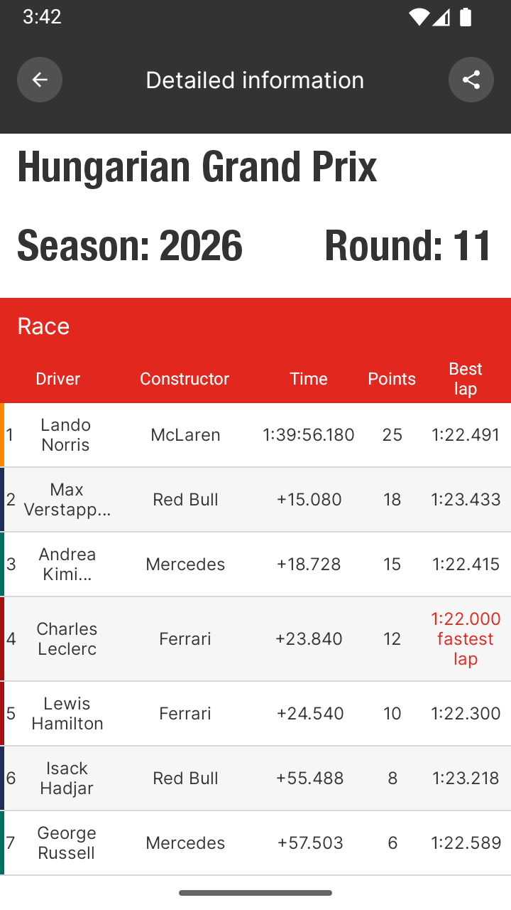
  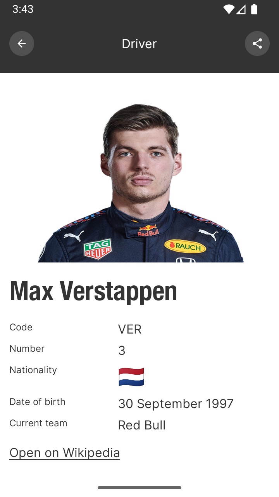
  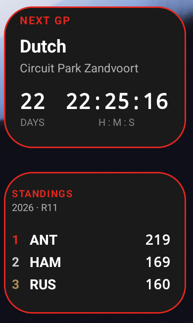
  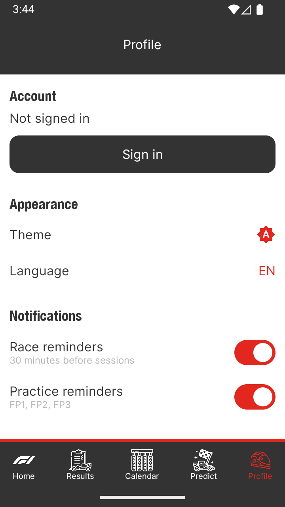
  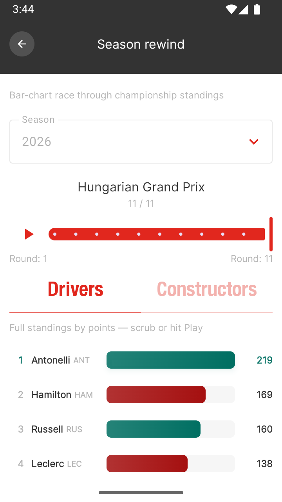
  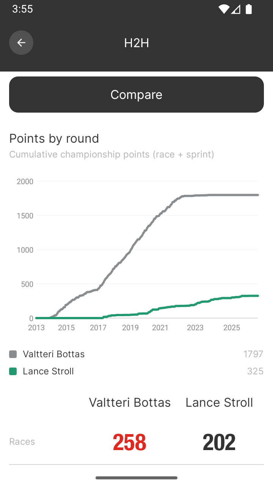
</p>

## Stack

| Layer | Tech |
|------|------------|
| UI | Jetpack Compose, Material 3, light/dark themes, type-safe Navigation Compose |
| Presentation | `@HiltViewModel` + `StateFlow<*UiState>` / `AsyncValue` |
| DI | Hilt (`IF1Repository`, `IEspnRepository`, auth/predictor repos) |
| Network | Retrofit + OkHttp + Moshi DTOs → domain mappers |
| Cache | Room (offline peek → refresh); ESPN in-memory TTL; soft `AppDataRefresh.clearAll` |
| Map | OSMDroid + OSMBonusPack (Carto tiles) |
| Backend | Firebase (Core, Auth, Firestore, Analytics, Crashlytics, Remote Config), AppMetrica |
| Tests | JVM unit (`app/src/test`, MockK) + Compose UI (`androidTest`, not in CI); Kover ≥75% |

### Differences from f1_pet_project (Flutter)

| Flutter | Kotlin |
|---------|--------|
| MobX | ViewModel + StateFlow |
| Auto Route | Type-safe Navigation Compose |
| Dio | Retrofit + Moshi |
| Yandex MapKit | OSMDroid |
| Prefs / interceptors | Room |
| Flutter widgets | Jetpack Compose |

## Architecture

- **Layers** — Compose screens → `@HiltViewModel` → `I*Repository` → Retrofit / Room / Firebase. Screens do not call Retrofit, OkHttp, or DAOs.
- **Jolpica** — `F1ApiService` only inside `F1Repository` via `ApiCallHandler.safeCall` → `Result`.
- **ESPN** — `EspnApiService` / `@EspnClient` inside `EspnRepository`.
- **Navigation** — `@Serializable` routes in `F1Routes.kt`; `composable<Route> { hiltViewModel() }` in `F1NavGraph.kt`.
- **Refresh** — `AppDataRefresh.clearAll()` soft-invalidates ESPN TTL + in-memory F1 caches (Room kept for offline).
- **Theme / locale** — `ThemeController`, `LocaleController` (RU/EN).
- **Analytics** — typed `AnalyticsEvent` + `AnalyticsGateway` (Firebase + AppMetrica); screen_view on nav changes.
- **Deep links** — `F1PetDeepLinks` / `DeepLinkBus` (`f1pet://driver|constructor|circuit/<id>`, `f1pet://race/live`, `f1pet://race/<season>/<round>`).
- **Home widgets** — standings top-3 + next GP countdown (`widgets/`).
- **Firebase** — bootstrap in `F1Application`; `google-services.json` gitignored; CI stub under `tool/ci/`. Project: `f1-kotlin`. Auth + Firestore for Profile / Predictor — see [`docs/firebase_setup.md`](docs/firebase_setup.md). App Check skipped for v1 (same practice as Flutter).
- **AppMetrica** — `local.properties` `appmetrica.apiKey`; empty → skip.
- **Remote Config** — `min_app_version` (force update).
- **Logging** — `AppLogger` + OkHttp logging in debug.

## Structure

```
f1_kotlin/
├── app/
│   └── src/
│       ├── main/
│       │   ├── assets/      # circuit layouts + circuit_stats.json
│       │   ├── java/        # PendingIntent / BootCompleted helpers
│       │   └── kotlin/com/example/f1_kotlin/
│       │       ├── data/    # API, Room, Firebase, AppMetrica, deeplink, analytics
│       │       ├── domain/
│       │       ├── di/
│       │       ├── ui/
│       │       ├── viewmodel/
│       │       ├── widgets/
│       │       ├── notifications/
│       │       └── util/
│       ├── test/            # JVM unit tests
│       └── androidTest/     # Compose UI tests (not in CI)
├── docs/                    # firebase_setup, screenshots
├── tool/ci/                 # google-services stub
└── .github/workflows/
```

## Requirements

- JDK **17+** (CI: Temurin **21**; app `jvmTarget` 11)
- Android Studio / Android SDK
- minSdk **30**, targetSdk **37**

## Secrets

Not in git.

### Firebase (`f1-kotlin`)

1. [Firebase Console](https://console.firebase.google.com/project/f1-kotlin/overview) → Your apps  
2. Android package **`com.example.f1_kotlin`** (+ debug SHA-1 fingerprint)  
3. `app/google-services.json` (gitignored)  
4. Enable Analytics, Crashlytics, Remote Config, Auth (Email/Password), Firestore — details in [`docs/firebase_setup.md`](docs/firebase_setup.md)

Without a real file, Gradle copies `tool/ci/google-services.stub.json`.

Remote Config: `min_app_version` (string).

### AppMetrica

Optional in `local.properties`:

```properties
appmetrica.apiKey=...
```

## Run

```bash
./gradlew :app:assembleDebug
./gradlew :app:installDebug
```

## Deep links

```text
f1pet://driver/<driverId>
f1pet://constructor/<constructorId>
f1pet://circuit/<circuitId>
f1pet://race/live
f1pet://race/<season>/<round>   # reminder tap → Results if that weekend is live, else Schedule
```

## Tests

**Unit (JVM)** — MockK + `kotlinx-coroutines-test` (+ Robolectric where needed); **Kover** gate **≥75%** on filtered business logic:

```bash
./gradlew :app:testDebugUnitTest
./gradlew :app:koverHtmlReportDebug
./gradlew :app:koverVerifyDebug
```

CI runs unit tests + Kover verify. Excluded from the gate (same idea as Flutter’s screen/l10n exclusions): UI / widgets / DI / notifications / Firebase bootstrap / Auth+Firestore predictor repos / heavy Predictor ViewModels / DTOs / `@Composable`. Covered: domain predictor services/models, auth form/VM, notifications prefs, widget format helpers, core ViewModels.

**Compose UI (`androidTest`)** — not in CI:

```bash
./gradlew :app:connectedDebugAndroidTest
```

## CI / CD

[](https://github.com/DaniilPavlov/f1_kotlin/actions/workflows/ci.yml)

| Workflow | When | What |
|----------|------|------|
| `ci.yml` | push / PR → `master` | Firebase stub, detekt, debug APK, unit tests, Kover ≥75% |
| `release.yml` | tag `v*` | APK + GitHub Release |

```bash
./gradlew :app:detekt :app:testDebugUnitTest :app:koverVerifyDebug
```

```bash
# version in app/build.gradle.kts must match the tag
git tag v2.0.0 && git push origin v2.0.0
```

Release secrets: `ANDROID_KEYSTORE_*` (required for upload signing); `GOOGLE_SERVICES_JSON`, `APPMETRICA_API_KEY` (optional).

```bash
keytool -genkey -v -keystore upload-keystore.jks -keyalg RSA -keysize 2048 -validity 10000 -alias upload
base64 -i upload-keystore.jks | pbcopy   # → ANDROID_KEYSTORE_BASE64
```

## Offline

Room peek first, then network refresh. If offline with cache, UI keeps last known data. ESPN uses short in-memory TTL; scoreboard failures hide the block instead of breaking Results. `refreshAll` soft-invalidates via `AppDataRefresh` (Room kept).

## Features

- **Home** — current season driver and constructor standings; ESPN headlines
- **Results** — weekend scoreboard (live polling), latest race, race search, hall of fame, season rewind (animated racing-bar standings by round), H2H (drivers / constructors) with points-by-round chart, finish statuses
- **Live race mode** — app-wide session banner while ESPN status is live; deep link `f1pet://race/live` → Results
- **Calendar** — monthly calendar with session times; on empty days shows next GP card (layout + countdown); local reminders 30 min before; circuits list/map
- **Predictor** — race/quali grid predictions (Auth + verified email + Firestore); lock before quali; season history, scoring, public leaderboard
- **Profile** — account (email/password), theme, locale, race / practice reminder prefs
- **Circuits** — list and map with pins/clusters, track layouts, length/laps/turns/speed/elevation, Wikipedia, winners history
- **Driver / Constructor cards** — ESPN photos, career stats with tappable wins / podiums / poles lists, share as image
- **Android home widgets** — top-3 standings + next GP countdown
- **Themes** — system / light / dark
- **A11y** — semantics on key lists and controls
- **Localization** — Russian and English
- **Force update** — blocking screen when below Remote Config `min_app_version`
- **Share** — career / race / weekend as PNG via system share sheet
- **Shimmer skeletons** — loading placeholders for main screens
- **Country flags** — nationality / country as emoji in tables and cards
